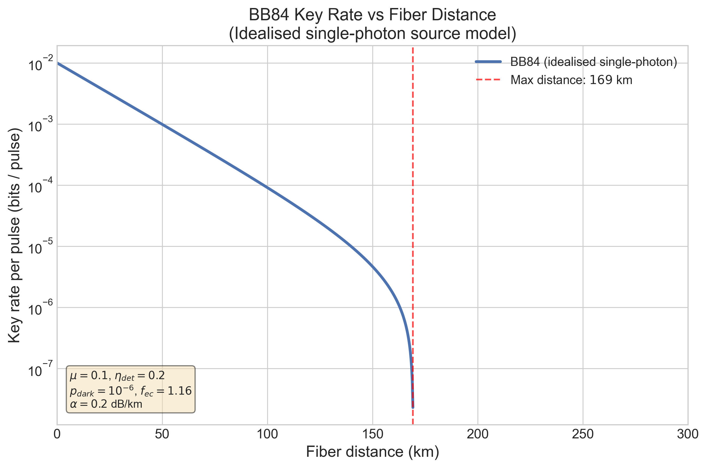
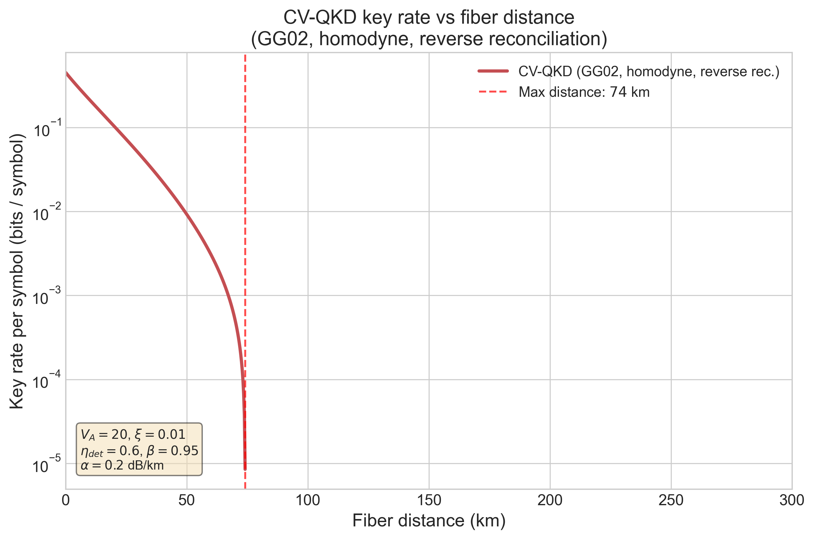
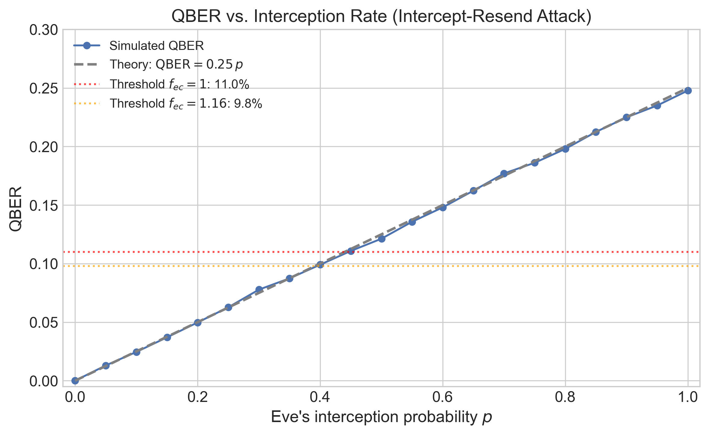

# QKD Protocol Simulator

> Comparing Discrete-Variable (BB84) and Continuous-Variable (GG02)
> Quantum Key Distribution under stated fiber-channel assumptions.

## Overview

This repository implements and compares two fundamental Quantum Key
Distribution (QKD) protocols: **BB84** (discrete-variable) and **GG02**
(continuous-variable). The code computes asymptotic secure key-rate bounds
under explicit, reproducible parameter sets.

The simulator shows how fiber attenuation, detector dark counts, excess
noise, and reconciliation efficiency constrain the maximum secure distance
for each protocol. All numbers in plots and tables are computed from the
code; no headline values are hardcoded.

The project is organized as a standalone scientific Python repository:
small numerical modules, executable notebooks, saved 300 dpi figures, and
regression tests that keep the stated assumptions visible.

## Headline Result

Under the default parameter sets used by the comparison notebook and
headline figure:

| Protocol | Source / detector | Trust model | Cutoff | K @ 50 km |
|---|---|---|---|---|
| BB84 | idealised single-photon source | -- (single-photon) | **169.4 km** | 9.876 x 10^-4 bits / pulse |
| CV-QKD GG02 | Gaussian-modulated coherent states, balanced homodyne | untrusted detector | **74.2 km** | 9.237 x 10^-3 bits / symbol |

> **Important caveat.** The two columns use different normalisations
> (per emitted pulse vs per coherent-state symbol) and different security
> models (asymptotic simplified BB84 vs asymptotic collective Gaussian
> attack). The cutoff column is not a universal performance ranking;
> changing detector efficiency, excess noise, dark counts, or reconciliation
> efficiency changes the relative ordering. See the parameter box on the
> figure for the exact assumptions.

## Key Figures

### BB84 key rate vs distance

The BB84 per-pulse key rate is computed as a function of fiber length under
the standard direct-link parameter set. The cutoff lies in the documented
150-200 km window for the idealised single-photon source model. Practical
weak-coherent-pulse security requires decoy-state analysis.

### CV-QKD key rate vs distance

The CV-QKD per-symbol key rate is computed from the Holevo bound using
symplectic eigenvalues of the joint Alice-Bob covariance matrix. The default
cutoff is 74.2 km, with excess noise as the dominant long-distance limiter.

### QBER under eavesdropping

The intercept-resend simulation verifies the canonical BB84 result: full
interception produces QBER = 25% from the Born rule applied twice
(1/2 x 1/2). Partial interception scales linearly: QBER = 0.25 x p.

A complete release inventory for the generated figures is in
[`figures/FIGURE_INVENTORY.md`](figures/FIGURE_INVENTORY.md).

## Technical Motivation

BB84 and GG02/CV-QKD are useful side-by-side because they expose different
physical and modelling tradeoffs. BB84 makes basis sifting, QBER, dark
counts, and decoy-state motivation transparent. GG02 brings in coherent
states, homodyne detection, covariance matrices, symplectic eigenvalues,
and the Holevo bound.

The repository keeps those concepts in a compact numerical form: vectorised
NumPy implementations, six notebooks that regenerate the figures, and tests
that lock the main physics checks and headline values.

