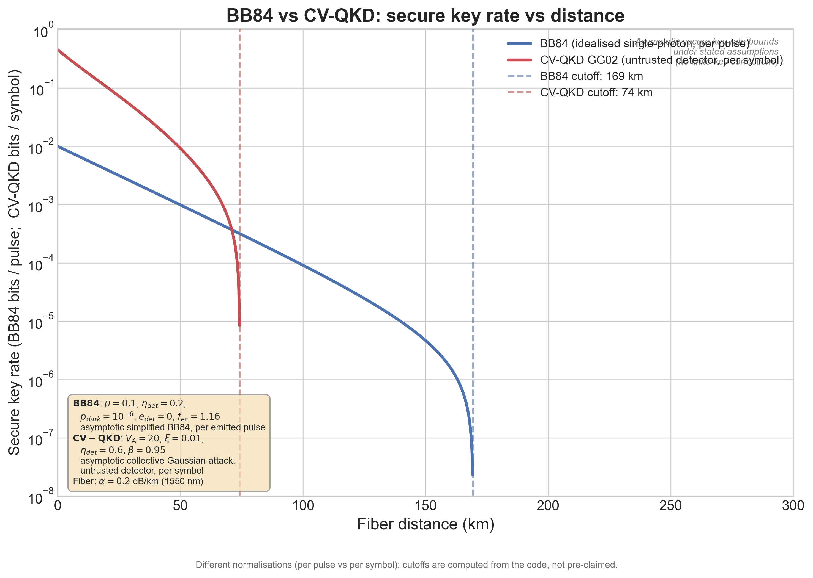

# QKD Protocol Simulator

> Comparing Discrete-Variable (BB84) and Continuous-Variable (GG02)
> Quantum Key Distribution under stated fiber-channel assumptions.

## Overview

This repository implements and compares two fundamental Quantum Key
Distribution (QKD) protocols: **BB84** (discrete-variable) and **GG02**
(continuous-variable). The code computes asymptotic secure key-rate bounds
under explicit, reproducible parameter sets.

The simulator shows how fiber attenuation, detector dark counts, excess
noise, and reconciliation efficiency constrain the maximum secure distance
for each protocol. All numbers in plots and tables are computed from the
code; no headline values are hardcoded.

The project is organized as a standalone scientific Python repository:
small numerical modules, executable notebooks, saved 300 dpi figures, and
regression tests that keep the stated assumptions visible.

